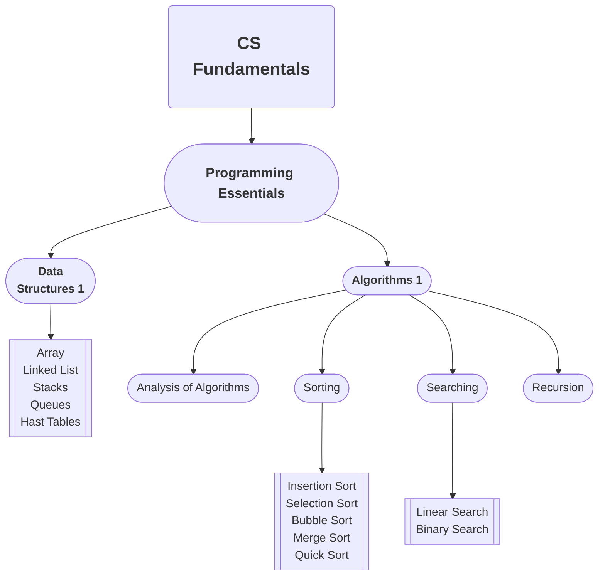

# Introduction to Computer Science and Fundamentals of Programming

## About

This is the roadmap for getting started into Computer Science, and/or getting start on new progamming languages. This covers fundamental topics in programming, data structures and algorithms. I believe this roadmap is simple yet comprehensive, and fast-paced that only covers essential knowledge needed for aspiring developers, without tackling advanced and specialized topics.

---

